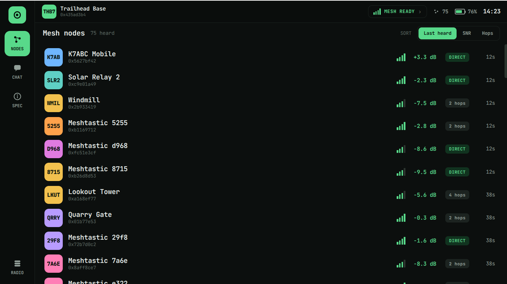

# Tab5-Meshtastic v2

A [Meshtastic](https://meshtastic.org) BLE client for the **M5Stack Tab5**
(ESP32-P4 + ESP32-C6). Pair to a Meshtastic radio over Bluetooth LE, browse the
mesh, read node detail + telemetry, and exchange broadcast text — an always-on
Meshtastic control surface. See [`PRD.md`](PRD.md) for the full spec.

The Tab5 is the touchscreen front-end; it has **no radio of its own**. Bluetooth
comes from the onboard **ESP32-C6**, reached over **esp-hosted** (SDIO): NimBLE
runs on the P4 as the host, with the controller on the C6 and HCI tunnelled over
the hosted link.



> The **Nodes** view — live mesh with signal, hops, and last-heard. (Design
> reference; the on-device render tracks it closely, if not pixel-for-pixel.)

## Features

- **Onboarding / device picker** — scan, pick a radio, enter its PIN, and it's
  remembered. No hardcoded address or PIN; auto-connects to the saved radio on
  boot. Supports both fixed and random PIN radios (you're prompted for the PIN
  when the radio asks for it).
- **Nodes** — live, sortable list (signal, hops, last-heard) with a detail view:
  SNR / hops / last-heard / battery, GPS position, and device metrics.
- **Chat** — send/receive broadcast text on the primary channel with an
  on-screen keyboard.
- Self-healing connection (poll-driven sync with read-timeout recovery) and an
  on-screen diagnostics overlay for debugging.

## Hardware setup

> **Plug the battery in first.** The Tab5 browns out (blank screen, drops off
> USB) on USB power alone — the internal battery must be connected to run or
> flash. If the screen is black after flashing, tap the power button.

The Tab5 enumerates as a USB CDC device. **Attaching serial resets the P4**, so
the on-screen diagnostics overlay (below) is the primary debugging surface, not
`idf.py monitor`.

Port assignment is **plug-order dependent**. Identify the Tab5 by its serial
before flashing (Tab5 P4 = `30:ED:A0:E1:5F:EB`):

```bash
for d in /dev/ttyACM*; do
  echo "$d -> $(udevadm info -q property -n $d | grep ID_SERIAL_SHORT | cut -d= -f2)"
done
```

## Build / flash

Requires **ESP-IDF v5.4.x**. The first build downloads `esp_hosted` (which
bundles the BT-capable C6 slave firmware), `esp_wifi_remote`, and LVGL via the
component manager.

```bash
idf.py set-target esp32p4
idf.py build
idf.py -p /dev/ttyACM<Tab5> flash      # battery plugged in first!
```

To start onboarding from scratch (clears saved devices **and** BLE bonds):

```bash
idf.py -p /dev/ttyACM<Tab5> erase-flash && idf.py -p /dev/ttyACM<Tab5> flash
```

## Using it

- **First boot** (nothing saved): the status chip shows `NO DEVICE`. Go to the
  **RADIO** tab → **Scan for devices** → tap your radio → enter its PIN when the
  keypad appears (the code shown on your radio, or `123456` for a fixed-PIN unit
  with no screen) → it bonds, syncs, and is saved.
- **Later boots**: auto-connects to the saved radio (no interaction).
- **RADIO tab** is the device manager: connect/switch between saved radios or
  **Forget** one (which drops its bond).
- **Diagnostics overlay**: **long-press the status bar** to reveal/hide the
  bottom strip (`stage  mtu.. rd.. ni.. ... wc.. err..`). Hidden by default.

## Architecture

Strict layering (see `PRD.md` §5) — the BLE/protocol layers never touch LVGL,
and the UI reaches the backend only through narrow commands:

```
ui/      LVGL task only. Renders an immutable AppState snapshot (a 500ms pump);
         emits commands (connect, send_text, …). ui_shell + theme.
app/     AppState — single mutex-guarded source of truth (conn state, node DB,
         message log, diagnostics) + NVS settings (saved devices).
mesh/    Pure Meshtastic protocol layer (nanopb encode/decode → tagged events).
         No BLE, no LVGL, no FreeRTOS — testable off-device.
ble/     NimBLE central: scan, bond, GATT, MTU, the poll/drain sync engine with
         read-timeout recovery and a self-healing connection state machine.
board/   PPA-rotation display init (landscape 1280x720).
```

`components/m5_tab5_component` is the in-tree board support (LCD/touch/power
expanders); `components/meshtastic_protos` is the vendored nanopb + generated
Meshtastic protobufs.

## Meshtastic BLE GATT

- Service `6ba1b218-15a8-461f-9fa8-5dcae273eafd`
- **ToRadio** (write) `f75c76d2-129e-4dad-a1dd-7866124401e7` — raw `ToRadio` protobuf
- **FromRadio** (read) `2c55e69e-4993-11ed-b878-0242ac120002` — raw `FromRadio`; 0 bytes when drained
- **FromNum** (read/notify) `ed9da18c-a800-4f66-a670-aa7547e34453` — subscribed but notifications don't traverse the hosted tunnel, so sync is **poll-driven**

Over BLE each characteristic carries a **raw protobuf** (no `0x94c3` framing —
that's serial/TCP only). Handshake: connect → bond (PIN) → MTU exchange →
discover chars → subscribe FromNum → write `want_config_id` → drain FromRadio
until `config_complete_id` → steady-state poll.
